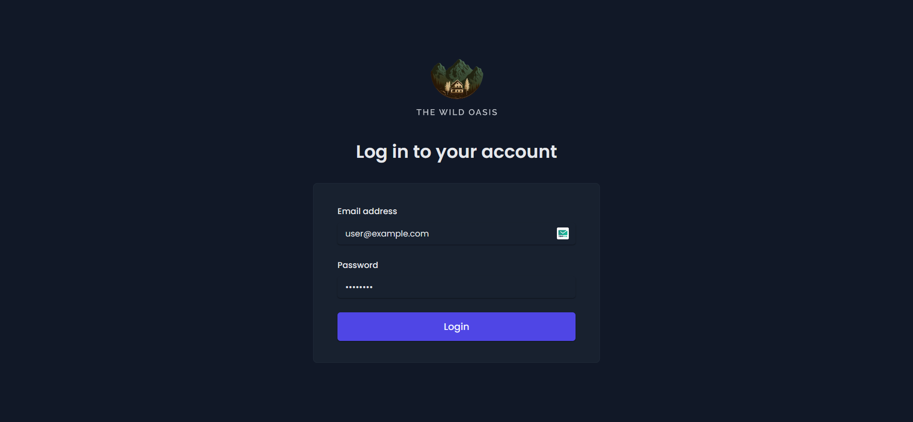
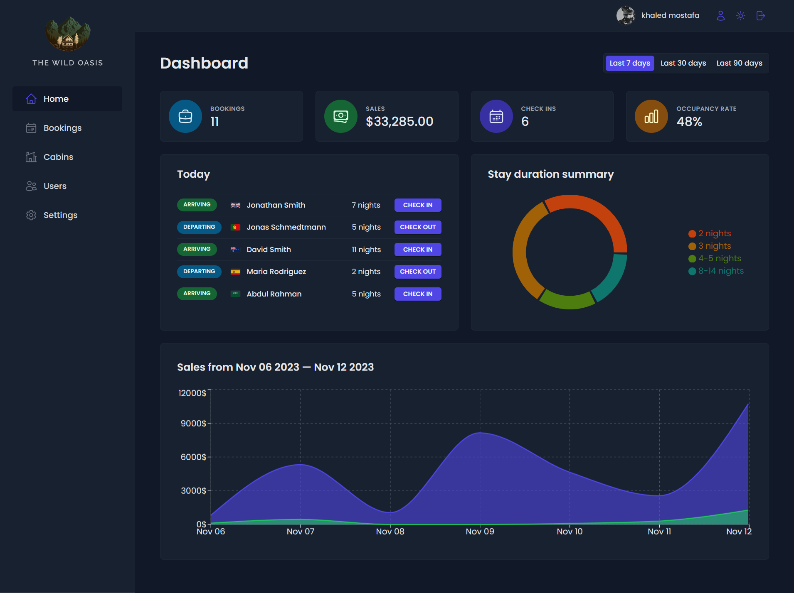
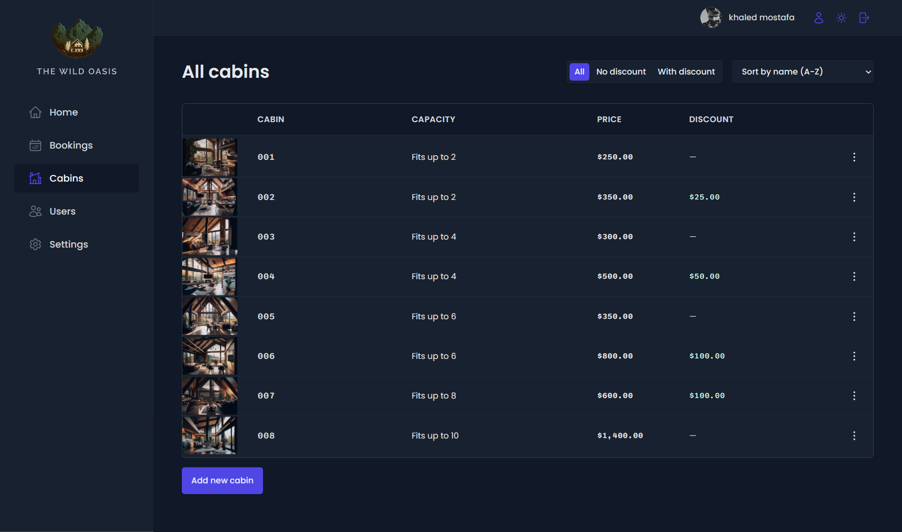
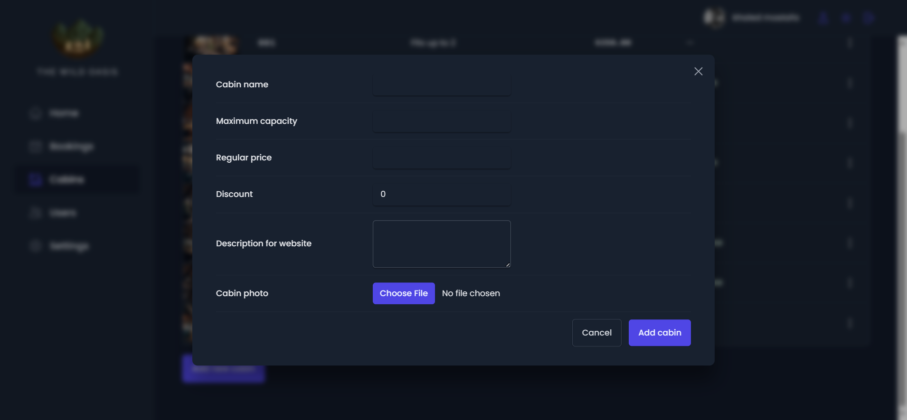
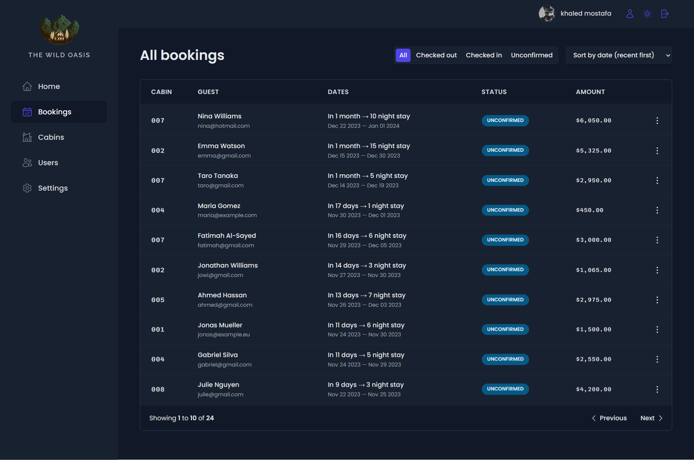
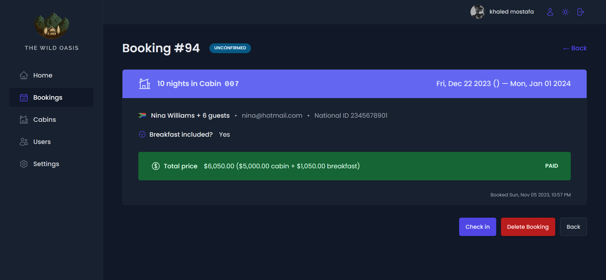
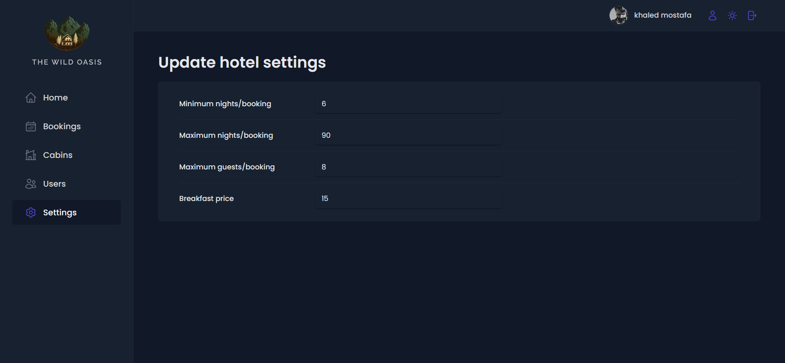
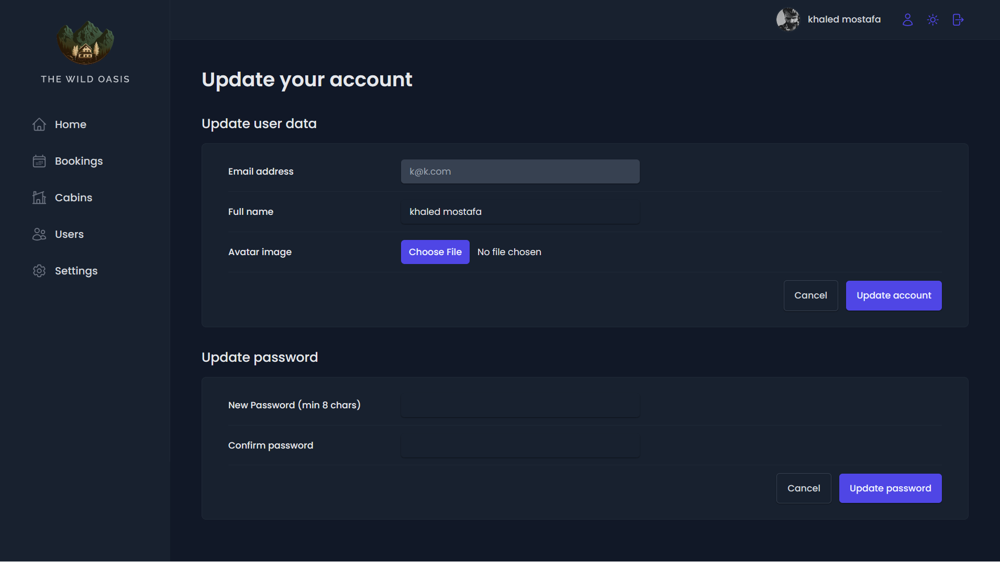
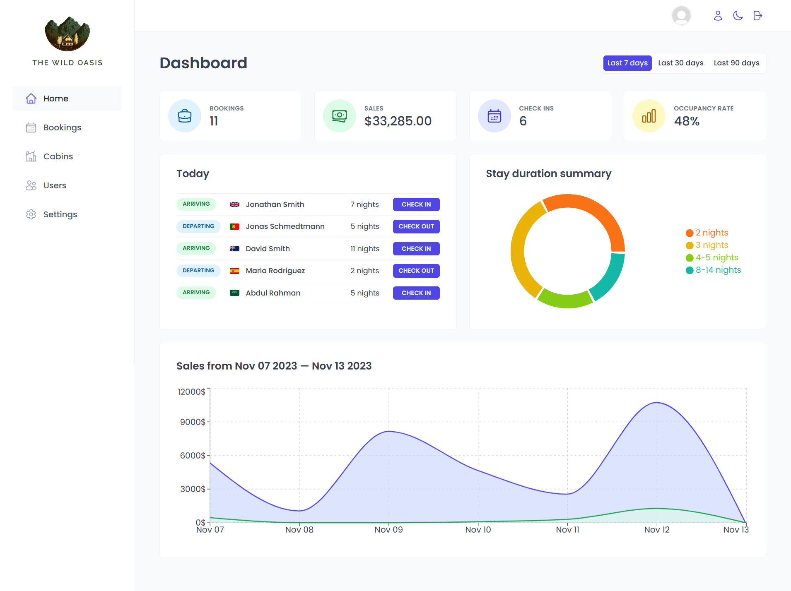

<div align="center">
</div>

## Table of Contents

- [Table of Contents](#table-of-contents)
- [👋Introduction](#introduction)
- [🌟Features](#features)
- [🚀 Live Demo](#-live-demo)
- [📸 Screenshots](#-screenshots)
  - [Login page](#login-page)
  - [Dashboard Page](#dashboard-page)
  - [Cabins Page](#cabins-page)
  - [Create Cabin](#create-cabin)
  - [Bookings Page](#bookings-page)
  - [Booking Page](#booking-page)
  - [Settings Page](#settings-page)
  - [Update Profile Page](#update-profile-page)
  - [Light Mode](#light-mode)
- [🛠️Technologies Used](#️technologies-used)
- [🏁Getting Started](#getting-started)
- [⬇️Installation](#️installation)
- [🔧Usage](#usage)
- [📄License](#license)

## 👋Introduction

The Wild Oasis Hotel Management App is a comprehensive and user-friendly application designed specifically for hotel employees. It empowers them to efficiently handle various tasks related to cabin management, bookings, and guest services. With a focus on security and ease of use, the app ensures that only authenticated hotel employees can access and utilize its features.

## 🌟Features

- User Authentication:

  - New users can only be signed up within the application, ensuring that only genuine hotel employees can create accounts.

- User Profile Management:

  - Users can upload avatars, change their names, and update passwords to personalize their profiles.

- Cabin Management:

  - Table view displaying all cabins with detailed information, including photos, names, capacity, price, and current discounts.

  - Users can update or delete existing cabins and create new ones, including the option to upload cabin photos.

- Booking Management:

  - Table view with detailed booking information, including arrival and departure dates, status, paid amount, cabin details, and guest data.
  - Filterable by booking status: "unconfirmed," "checked in," or "checked out."
  - Users can delete, check in, or check out a booking as guests arrive.

- Payment Handling:

  - On check-in, users can confirm payment receipt, acknowledging whether bookings have been paid.
  - Guests have the option to add breakfast for their entire stay during check-in.

- Guest Data Management:

  - Comprehensive guest data, including full name, email, national ID, nationality, and a country flag for easy identification.

- Dashboard:

  - Initial screen displaying essential information for the last 7, 30, or 90 days.
  - List of guests checking in and out on the current day, allowing users to perform related tasks.
  - Statistics on recent bookings, sales, check-ins, and occupancy rates.
  - Charts showing daily hotel sales (total and extras like breakfast) and stay duration statistics.

- Application-Wide Settings:

  - Users can define settings such as breakfast price, minimum and maximum nights per booking, and maximum guests per booking.

- Dark Mode:

  - A user-friendly dark mode for enhanced visibility and reduced eye strain during low-light conditions.

## 🚀 Live Demo

[the wilde oasis](https://the-wild-oasis-ts.netlify.app)

## 📸 Screenshots

### Login page



### Dashboard Page



### Cabins Page



### Create Cabin



### Bookings Page



### Booking Page



### Settings Page



### Update Profile Page



### Light Mode



## 🛠️Technologies Used

The the wild oasis project utilizes the following technologies:

- [React](https://reactjs.org/)
- [TypeScript](https://www.typescriptlang.org/)
- [supabase](https://supabase.io/)
- [react-query](https://react-query.tanstack.com/)
- [react-hook-form](https://react-hook-form.com/)
- [react-router-dom](https://reactrouter.com/web/guides/quick-start)
- [recharts](https://recharts.org/en-US/)
- [styled-components](https://styled-components.com/)
- [react-toastify](https://fkhadra.github.io/react-toastify/introduction)
- [react-icons](https://react-icons.github.io/react-icons/)
- [date-fns](https://date-fns.org/)

## 🏁Getting Started

To set up the the wild oasis project locally, follow the instructions below.

## ⬇️Installation

1. Clone the repository:

   ```bash
   git clone https://github.com/khaled-farahat/the-wild-oasis.git
   cd the-wild-oasis
   ```

1. Install the dependencies:

   ```bash
   npm install
   ```

## 🔧Usage

1. Run the development server:

   ```bash
   npm run dev
   ```

1. Open your browser and navigate to [http://localhost:5173/](http://localhost:5173/) to access the wild oasis application.

## 📄License

The the wild oasis project is open-source and is licensed under the [MIT License](LICENSE) .
